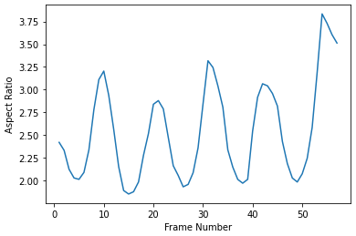

# **Gait Cycle Detection usng Aspect Ratio Curve**

> The CASIS B dataset has been selected for this project. The aspect ratio is then calculated by measuring each object's height and width through a bounding box. We can see in Figure that the bounding box is wide when the legs are separated and narrow when the bounding box is close to the feet. By calculating the aspect ratio, this concept aids in identifying the gait cycle. Finally, we discover that the gait cycle corresponds to three local minima in the aspect ratio curve.

### 

### 
